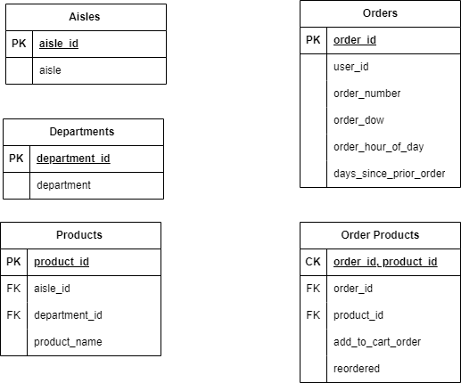
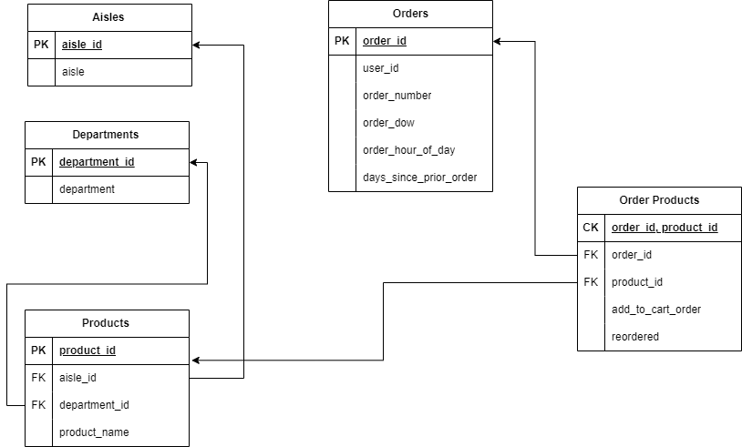

# E-Commerce Data Analysis

This repository contains a set of Jupyter notebooks designed to facilitate the analysis of e-commerce data. The project is structured to include data preparation, database management, and a main execution pipeline using tools such as Polars, PyODBC, and others.

## Table of Contents

- [Overview](#overview)
- [Installation](#installation)
- [Notebooks](#notebooks)
- [Usage](#usage)
- [Project Structure](#project-structure)

## Overview

This project aims to provide a comprehensive framework for analyzing e-commerce data. The notebooks included guide users through the entire process—from data extraction and transformation to database management and final data analysis.

## Data Model
**RAW DATA MODEL**

 

**INSIGHT DATA MODEL**



## Installation

Before running the notebooks, ensure you have the following Python packages installed:

```bash
pip install pyodbc polars import-ipynb pyarrow
```

## Notebooks

### 1. **Data Preparation (`data_prepn.ipynb`)**
   - **Description**: This notebook handles the initial data preparation tasks. It includes importing necessary libraries, reading CSV files into Polars DataFrames, and performing initial data transformations such as type casting and handling null values.
   - **Key Features**:
     - Reads multiple CSV files and stores them as Polars DataFrames.
     - Provides methods to cast integer columns to strings and vice versa.
     - Fills null values and retrieves column names.

### 2. **Database Management (`database.ipynb`)**
   - **Description**: This notebook is dedicated to managing SQL Server databases. It covers establishing connections, executing Data Definition Language (DDL) and Data Manipulation Language (DML) operations using PyODBC.
   - **Key Features**:
     - Connects to SQL Server using PyODBC.
     - Provides blueprints for executing SQL queries and managing database transactions.
   
### 3. **Main Execution Pipeline (`main.ipynb`)**
   - **Description**: This notebook serves as the main pipeline that integrates data preparation and database management steps. It ensures that the processed data is ready for in-depth analysis.
   - **Key Features**:
     - Installs required packages (`pyodbc`, `polars`, `import-ipynb`).
     - Runs the primary workflow for data processing and analysis.

## Usage

1. **Clone the repository**:
   ```bash
   git clone https://github.com/SNEHILUPADHYAY007/ecommerce-data-analysis.git
   ```
2. **Install the required packages**:
   ```bash
   pip install pyodbc polars import-ipynb pyarrow
   ```
3. **Run the notebooks** in the following order:
   - Start with `data_prepn.ipynb` for data preparation.
   - Proceed to `database.ipynb` for database management tasks.
   - Finally, execute `main.ipynb` to run the complete data analysis pipeline.

## Project Structure

```
ecommerce-data-analysis/
│
├── data-model/                      # Contains data model definitions and related files
│   ├── insight_data_model           # Data Model of the Insight tables 
    └── raw_data_model               # Data Model of the Raw tables 
│
├── insight_tbl_ddl_queries/         # SQL queries for creating insight tables
│   ├── aisles.sql                   # Table Query for Aisles Insight table
│   ├── department.sql               # Table Query for department Insight table
│   ├── order_products.sql           # Table Query for order_products Insight table
│   ├── orders.sql                   # Table Query for orders Insight table
│   └── products.sql                 # Table Query for products Insight table
│   
├── notebooks/                       # Jupyter notebooks for various tasks
│   ├── data_prepn.ipynb             # Data preparation notebook
│   ├── database.ipynb               # Database handling notebook
│   └── main.ipynb                   # Main analysis notebook
│
├── workflow.png                     # Image representing the workflow
├── .gitignore                       # Git ignore file
├── README.md                        # Project documentation

```
**Notes:-**
1. DATA can be found here:- https://drive.google.com/drive/folders/1pjmEQOxse7Q3kldm7YPBUANS4Nlo7rCc (Taken From Darshil Parmar SQL course)
2. SERVER AND DB information has been removed. Please use this Class to instantiate the Instance Variables.
